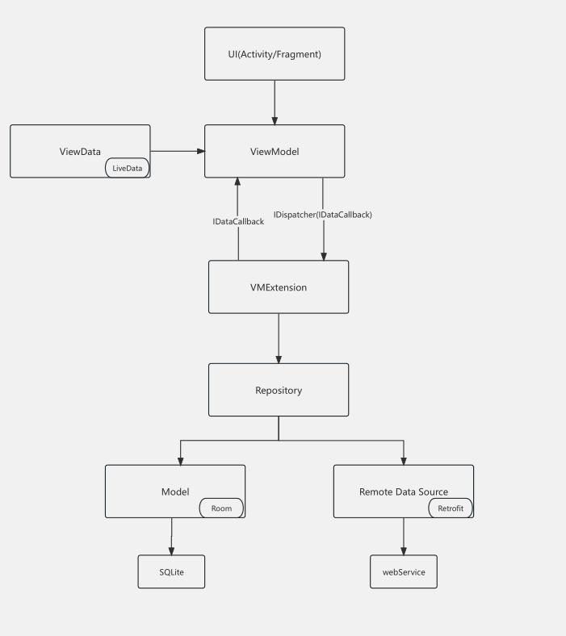

# Android MVVM

Main architecture:
1.Use DataBinding to reduce the burden on Activity or Fragment,
2.ViewData and UseCase reduce ViewModel,
3.User behavior operation is defined through Dispatcher,
4.The interface state calls are set to the UI layer through IDataCallback to the UI layer.

